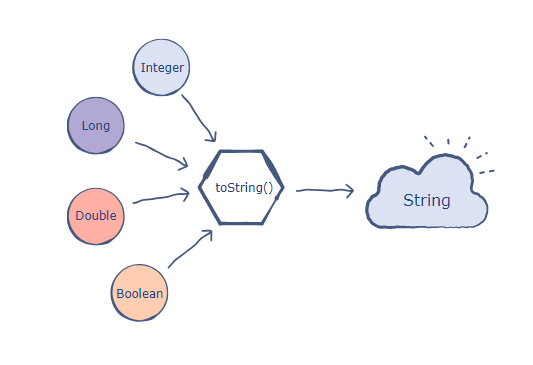

## ডটা Type of Number ( নাম্বার )

#### Number Methods

##### <li>toString

##### <li>toFixed

##### <li>toPrecision

##### <li>parseInt

##### <li>parseFloat

#### 1. “toString” কী, ও কেনো, কোথায় ব্যবহার করা হয়?



<p> এটি মূলত যে কোনো নাম্বার, বুলিয়ান, এ্যরেকে সিট্রং-এ কনভার্ট বা রূপ দিয়ে থাকে । অর্থাৎ এটি একটি সাধারণ অবজেক্ট সিট্রং রিটার্ন করে। এটি জাভাস্ক্রিপ্ট বিল্ট-ইন মেথডস।

##### উধহারণ:- 1

```js
const x = 123;

const result = x.toString();

console.log(result); //Output 123

//Expected output: 123
```

##### উধহারণ:- 2

```js
const anyArray = [1, 2, 3];

const result = anyArray.toString();

console.log(result); //Output "1,2,3"

//Expected output: "1,2,3"
```

##### উধহারণ:- 3

```js
const anyArray = [1, 2, 3];

const result = anyArray.toString();

console.log(result); //Output "1,2,3"

//Expected output: "1,2,3"
```
